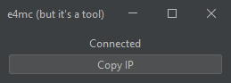

# e4mc (but it's a tool)

e4mc is a Minecraft mod that allows opening a singleplayer world to the entire world. (See https://e4mc.link/ for the
mod)

e4mcbiat (e4mc but it's a tool) allows you to do this without the mod, making it viable for older versions of the games.

You get a new domain (IP) every time you open the tool as opposed to every time you open to lan. This is useful for
speedrunning, as many worlds are played during a session, and it may also be useful for casual gameplay where a world
restart is needed.

## Developing

The GUI is made with the IntelliJ IDEA form designer, if you intend on changing GUI portions of the code, IntelliJ
IDEA must be configured in a certain way to ensure the GUI form works properly:

- `Settings` -> `Build, Execution, Deployment` -> `Build Tools` -> `Gradle` -> `Build and run using: IntelliJ Idea`
- `Settings` -> `Editor` -> `GUI Designer` -> `Generate GUI into: Java source code`

To build a runnable jar, use `./gradlew shadowJar`.