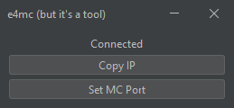

# e4mc (but it's a tool)

e4mc is a Minecraft mod that allows opening a singleplayer world to the entire world. (See https://e4mc.link/ for the
mod)

e4mcbiat (e4mc but it's a tool) allows you to do this without the mod, making it viable for older versions of the games.

You get a new domain (IP) every time you open the tool as opposed to every time you open to lan. This is useful for
speedrunning, as many worlds are played during a session, and it may also be useful for casual gameplay where a world
restart is needed.

## Running

e4mcbiat requires Java 11+ to run. You can get e4mcbiat by downloading the jar
from [releases](https://github.com/DuncanRuns/e4mcbiat/releases).

On Windows, you can run e4mcbiat by double-clicking the file.

On other platforms, you should open a terminal in the directory containing the e4mcbiat jar, then run the command
`java -jar e4mcbiat-x.x.x-all.jar`, replacing `x.x.x` with the actual version of e4mcbiat.

You can also run e4mcbiat without a GUI by providing a `nogui` argument: `java -jar e4mcbiat-x.x.x-all.jar nogui`. You
can also specify a custom port by providing a port argument: `java -jar e4mcbiat-x.x.x-all.jar nogui port=25566`. While
in nogui mode, you can safely stop by entering `stop` into the terminal.

## Developing

The GUI is made with the IntelliJ IDEA form designer, if you intend on changing GUI portions of the code, IntelliJ
IDEA must be configured in a certain way to ensure the GUI form works properly:

- `Settings` -> `Build, Execution, Deployment` -> `Build Tools` -> `Gradle` -> `Build and run using: IntelliJ Idea`
- `Settings` -> `Editor` -> `GUI Designer` -> `Generate GUI into: Java source code`

To build a runnable jar, use `./gradlew shadowJar`.